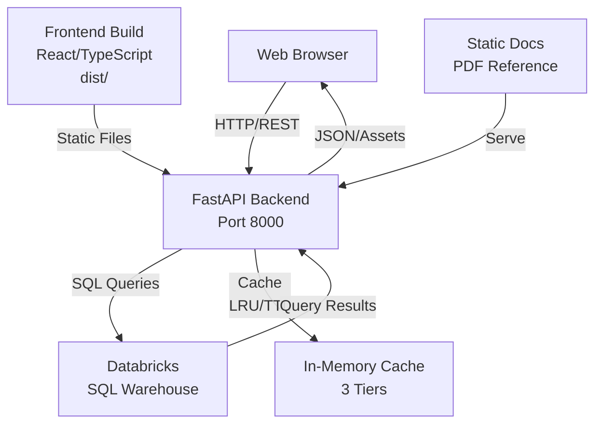

# CURES 2.0 Application White Paper

**Application:** CURES 2.0 - Community Care Utilization & Reporting Enterprise System  
**Version:** 2.0  
**Date Prepared:** September 23, 2026  
**Primary Data Source:** Databricks Unity Catalog (informatics_prod.engineers.rc_header)  
**Technology Stack:** React 18 (TypeScript) + FastAPI + Databricks SQL

---

## Executive Overview

CURES 2.0 is an enterprise data analytics platform designed for healthcare organizations to analyze, report on, and forecast claims data with sophisticated filtering, visualization, and natural language query capabilities. The system provides comprehensive visibility into claims utilization, financial metrics, referral patterns, and patient demographics across multiple organizational dimensions (VISN, Station, Category of Care, SEOC).

### Key Capabilities at a Glance

| Capability | Purpose | User Benefit |
|---|---|---|
| **KPI Dashboard** | Real-time health metrics | Executive summary of claims volume, costs, and utilization |
| **Multi-Dimensional Filtering** | Slice data by 9 dimensions | Granular analysis by VISN, station, care type, fiscal year, etc. |
| **Genie Ad-Hoc Reporting** | Natural language queries | Non-technical users can ask questions in English, get SQL results |
| **Claims Analysis** | Paid claims by year/category | Understand claims distribution and trends |
| **Financial Reporting** | Cost by provider/state/ICD | Provider and procedure-level financial insights |
| **Referral & Claim Analysis** | Referral patterns & lifecycle | Track referral origination and claim flow |
| **Geospatial Mapping** | Patient and facility locations | Visual distribution of patients and facilities |
| **Inpatient Insights** | Inpatient claim detail & pivots | Matrix and categorical analysis for inpatient services |
| **Top 10 Analysis** | High-impact items ranking | Identify top providers, procedures, and cost drivers |
| **"Close to Me" Reporting** | Proximity-based analysis | Facilities and services near patient/provider locations |
| **Forecast Modeling** | Future claim volume prediction | Long-term planning and resource allocation |

---

## Who Uses It and Why

| User Persona | Primary Need | Key Features |
|---|---|---|
| **Healthcare Executive** | Understand claims portfolio performance and cost trends | Home KPI dashboard, financial reports, forecasts |
| **Finance Manager** | Analyze spending by provider, procedure, state, and ICD code | Financial & Provider report, pivot tables, paid claims |
| **Operations Manager** | Monitor claim volume and inpatient utilization trends | Claims analysis, inpatient matrix, referral tracking |
| **Data Analyst** | Build custom analyses on demand | Genie ad-hoc reporter, detail export, filters |
| **Compliance Officer** | Document claims data patterns and documentation | Documentation page, detail records, audit trails |
| **Clinical Director** | Understand referral patterns and care utilization | Referral reports, close-to-me (geographic proximity), inpatient detail |

---

## Application Architecture

### System Overview



### Technology Stack

**Frontend:**
- React 18.3 with TypeScript 5.4
- Vite 5.4 (build tool)
- Recharts 2.12 (charting library)
- React Router DOM 6.22 (SPA routing)
- Mapbox GL (geospatial mapping)

**Backend:**
- FastAPI (async Python web framework)
- Uvicorn (ASGI server)
- Databricks SDK (workspace client & SQL execution)
- Pydantic 2.0+ (data validation)
- Query caching with tiered TTL

**Infrastructure:**
- Databricks Unity Catalog
- SQL Warehouse (a4f1bded75bd0627)
- Genie Space (01f15e82440d10d2814a2c5579aaa82b) for natural language report building

---

## Functional Walkthrough

### 1. **Home Page**

**Purpose:** Executive summary and KPI quick view

**Components:**
- **6 KPI Cards** displaying key metrics:
  - Total Claims (📋) — aggregate claim count
  - Total Disbursed (💰, currency format) — aggregate payment amount
  - Avg Cost/Claim (📊, currency) — per-claim cost average
  - Unique Patients (👥) — distinct patient count
  - Total Referrals (🔗) — referral volume
  - Total Billed (🏥, currency) — aggregate billed amount

- **Styled Card Layout:**
  - Each card features a colored icon background (blue, green, orange, purple, red, cyan)
  - Colored left border accent matching icon color
  - Responsive flex layout for mobile/tablet viewing
  - Light background gradient header
  
- **Data Loading:**
  - KPIs are fetched from `/api/summary/kpis` with current filter state applied
  - Loading spinner shown while data loads
  - Real-time filter integration (filters apply to home KPIs)

**Backend Query Logic:**
```sql
SELECT 
  COUNT(*) AS total_claims,
  SUM(payment_amount) AS total_disbursed,
  AVG(payment_amount) AS avg_cost_per_claim,
  COUNT(DISTINCT patient_id) AS unique_patients,
  COUNT(DISTINCT referral_id) AS total_referrals,
  SUM(billed_amount) AS total_billed
FROM informatics_prod.engineers.rc_header
WHERE [filters applied]
```

---

### 2. **COC & SEOC Page**

**Purpose:** Category of Care (COC) and Service Episode of Care (SEOC) analysis

**Reports:**
- **By Category of Care** — breakdown of claims/cost/utilization by COC
- **By SEOC** — similar breakdown by SEOC classification

**Visualizations:**
- Tabular data showing claim counts, totals, and averages
- Sortable columns for quick ranking
- Export capability for downstream analysis

**Typical COC Values:**
- Inpatient Care
- Outpatient Care
- Primary Care
- Specialty Care
- Telehealth
- (values populated from filter endpoint)

**Backend APIs:**
- `GET /api/coc-seoc/by-coc` — Claims grouped by category of care
- `GET /api/coc-seoc/by-seoc` — Claims grouped by SEOC

---

### 3. **Paid Claims Page**

**Purpose:** Historical and trend analysis of paid claims

**Reports:**
- **Claims by Year** — year-over-year claim volume and cost
- **Claims by Category** — claims segmented by COC
- **Claims by Form Type** — breakdown by claim form (CMS-1450, CMS-1500, etc.)
- **Claims by IP Flag** — inpatient vs. outpatient split
- **Claims by Fiscal Year** — fiscal year aggregation (FY23, FY24, FY25, etc.)
- **VISN-FY Pivot** — 2D matrix: rows=VISN, columns=Fiscal Year, values=claim metrics

**Key Features:**
- Multi-series charts (line/bar) showing trends
- Pivot table for cross-tabulation
- Drill-down capability to detail records

**Backend APIs:**
- `GET /api/claims/by-year`
- `GET /api/claims/by-category`
- `GET /api/claims/by-form-type`
- `GET /api/claims/by-ip-flag`
- `GET /api/claims/by-fiscal-year`
- `GET /api/claims/visn-fy-pivot`

---

### 4. **Inpatient Report Page**

**Purpose:** Dedicated inpatient claims analysis

**Reports:**
- **Inpatient Detail** — line-item detail for inpatient claims
- **Inpatient Matrix** — summary metrics for inpatient by dimensions
- **Inpatient Pivot by COC** — inpatient claims pivoted by category of care

**Metrics Shown:**
- Claim count
- Total billed
- Total paid/disbursed
- Average cost per claim
- Patient volume
- Average length of stay (if available in source)

**Backend APIs:**
- `GET /api/inpatient/detail`
- `GET /api/inpatient/matrix`
- `GET /api/inpatient/pivot-coc`

---

### 5. **Patient Map**

**Purpose:** Geospatial visualization of patient distribution

**Features:**
- Interactive Mapbox GL map centered on patient locations
- Patient pins/clusters showing concentration
- Zoom and pan controls
- Hover tooltips showing location details
- Layer toggles for on/off control

**Data Fields:**
- Patient residence address/ZIP code
- Claim count per location
- Average claim cost
- State/county boundaries

**Backend API:**
- `GET /api/patient-map` — Returns geoJSON features or lat/long points

---

### 6. **Facility Map**

**Purpose:** Locate and visualize healthcare facilities

**Features:**
- Interactive map of all facilities in the dataset
- Facility markers with name/ID on hover
- Claim volume color-coding (heat map style)
- Filter by facility type (VA, Community, etc.)

**Data Fields:**
- Facility name and location
- Total claims processed
- Total cost
- Average claim cost

**Backend API:**
- `GET /api/facility-map` — Returns facility locations and metrics

---

### 7. **Financial & Provider Page**

**Purpose:** Provider-centric financial analysis

**Reports:**
- **By VISN** — financial rollup by Veterans Integrated Service Network
- **By Provider** — individual provider cost and utilization
- **By State** — geographic financial summary
- **By ICD Code** — diagnosis-based cost analysis
- **By Procedure Code** — procedure-based cost analysis
- **By Station** — station/facility-level financial summary

**Key Metrics:**
- Total billed amount
- Total paid/disbursed
- Average cost per claim
- Claim count
- Unique patient count
- Provider specialization (when available)

**Backend APIs:**
- `GET /api/financial/by-visn`
- `GET /api/financial/by-provider`
- `GET /api/financial/by-state`
- `GET /api/financial/by-icd`
- `GET /api/financial/by-procedure`
- `GET /api/financial/by-station`

---

### 8. **Referral & Claim Page**

**Purpose:** Understand referral origination and claim lifecycle

**Reports:**
- **Referral Summary** — high-level referral counts and status
- **Referrals by COC** — referral volume by category of care
- **Referrals by SEOC** — referral volume by SEOC

**Typical Referral States:**
- Pending
- In Progress
- Approved
- Denied
- Closed

**Metrics:**
- Referral count
- Associated claim volume
- Average days from referral to claim
- Approval rate

**Backend APIs:**
- `GET /api/referral/summary`
- `GET /api/referral/by-coc`
- `GET /api/referral/by-seoc`

---

### 9. **Top 10 Page**

**Purpose:** Identify high-impact drivers and outliers

**Reports:**
- **Top 10 by COC** — categories of care with highest claim volume/cost
- **Top 10 by SEOC** — highest-impact SEOCs
- **Top 10 by Provider** — costliest or busiest providers
- **Top 10 by Procedure** — most-used procedures and their costs

**Visualizations:**
- Ranked bar charts (horizontal or vertical)
- Sorted tables with cost/volume ranking

**Backend APIs:**
- `GET /api/top10/by-coc`
- `GET /api/top10/by-seoc`
- `GET /api/top10/by-provider`
- `GET /api/top10/by-procedure`

---

### 10. **Close to Me Page**

**Purpose:** Proximity-based analytics and recommendations

**Reports:**
- **VA Metrics** — VA facilities near a given location
- **Community Care Metrics** — community providers near a given location
- **Close to Me Map** — interactive map showing nearby facilities
- **Close to Me Categories** — nearby services by category
- **Telehealth Options** — telehealth availability in a geographic area

**Use Case:** A patient wants to know what providers and services are nearby their home address or a reference location.

**Backend APIs:**
- `GET /api/close-to-me/va-metrics`
- `GET /api/close-to-me/cc-metrics`
- `GET /api/close-to-me/map`
- `GET /api/close-to-me/categories`
- `GET /api/close-to-me/telehealth`

---

### 11. **Detail Page**

**Purpose:** Line-item drill-down and claim-level data export

**Features:**
- Full claim record details (claim ID, status, dates, amounts)
- Patient information (name, date of birth, ID)
- Provider and facility information
- Procedure codes and diagnosis codes
- Payment timeline and status
- Export to CSV/Excel

**Backend API:**
- `GET /api/detail` — Returns detailed claim records based on filters

---

### 12. **Documentation Page**

**Purpose:** Reference and compliance documentation

**Content Served:**
- PDF documents from `static/docs/`:
  - Cures Fact Pipeline - Executive Documentation
  - Cures_Fact_Business_Process_Document
  - Cures_Fact_Data_Workflow_Instructions
  - Cures_Fact_SOP
  - Cures_Fact_Technical_Process_Document
  - Technical_Reference_CURES_Fact_Data_Dictionary

**Features:**
- Embedded PDF viewer or download links
- Full-text search across documentation (if indexed)

**Backend API:**
- `GET /docs/*` — Serves static PDF files from `static/docs/`

---

### 13. **Ad Hoc Report Page (Genie Chat)**

**Purpose:** Natural language query interface for data exploration

**Workflow:**
1. User types a question in English (e.g., "How many inpatient claims in FY24?")
2. Frontend calls `POST /api/genie/start` to initiate a Genie conversation
3. Backend forwards to Databricks Genie with the Genie Space ID
4. User polls `GET /api/genie/poll` for status and response
5. Once ready, user fetches query results via `GET /api/genie/results`
6. Results rendered as table in the UI with column headers and data rows

**Components:**
- **Message Input** — text field for natural language question
- **Message History** — conversation thread with all Q&A
- **Status Indicator** — shows "Pending", "Executing Query", "Completed", or "Failed"
- **Results Table** — formatted data display
- **Copy/Export** — ability to copy query or export results

**Example Queries:**
- "Show me total claims by VISN for FY24"
- "Which procedures had the highest cost?"
- "How many patients were seen in telehealth?"

**Backend APIs:**
- `POST /api/genie/start` — Initiate a conversation with Databricks Genie
- `POST /api/genie/message` — Send a user message to Genie
- `GET /api/genie/poll` — Poll for response status and content
- `GET /api/genie/results` — Fetch the actual query result data

---

### 14. **About Page**

**Purpose:** App information and metadata

**Content:**
- CURES 2.0 description and mission
- Version number (2.0)
- Release date
- Support contact information
- Glossary of terms (VISN, SEOC, COC, etc.)
- Links to documentation
- License/attribution information

---

## Cross-Cutting Capabilities

### Multi-Select Filtering

**9 Filter Dimensions:**
1. **VISN** (Veterans Integrated Service Network) — organizational hierarchy level
2. **STN 3-Digit** — station code (3-character)
3. **STN 6-Digit** — extended station code (6-character)
4. **Category of Care** — type of care provided
5. **SEOC** — Service Episode of Care classification
6. **Claim Form Type** — CMS-1450, CMS-1500, etc.
7. **Procedure Code** — specific medical procedures (CPT codes)
8. **Fiscal Year** — FY23, FY24, FY25, etc. (Oct-Sep)
9. **Month-Year** — monthly granularity (Jan-24, Feb-24, etc.)

**Date Filters:**
- Service Date (from/to)
- Claim Load Date (from/to)
- Payment Date (from/to)

**Additional Filters in Backend:**
- Benefit Flag (beneficiary classification)
- Claim Status (pending, paid, denied, etc.)
- Is Current (Y/N) — only current claims, or historical

**Implementation:**
- Query parameters passed as comma-separated values (e.g., `?visn=001,002&fiscal_year=FY24`)
- Backend builds WHERE clause using SQL parameterization (safe from injection)
- Filters cascade to all APIs (KPIs, detail, reports, etc.)
- Default behavior: `is_current='Y'` unless explicitly overridden

**Filter Options API:**
- `GET /api/filters/{filter_name}` — Returns available values for a given filter dimension

---

### Query Caching Strategy

**Three-Tier Caching with Tiered TTLs:**

| Cache Tier | TTL | Purpose | Max Size |
|---|---|---|---|
| **Data Cache** | 30 minutes (1800s) | Summary tables & report data | 200 queries |
| **Filter Cache** | 15 minutes (900s) | Filter option dropdowns | 50 queries |
| **Forecast Cache** | 60 minutes (3600s) | ML forecast results (expensive) | 20 queries |

**Cache Key:** MD5 hash of the full SQL query string

**Eviction Policy:** LRU (Least Recently Used) when max size exceeded

**Cache Stats Endpoint:**
- `GET /api/debug` — Returns cache hit rate, size, and performance metrics

**Benefits:**
- Reduces load on Databricks SQL warehouse
- Faster response times for repeated queries
- Efficient use of warehouse compute credits

---

### Performance & Monitoring

**Backend Observability:**
- Request logging (implicit via FastAPI/Uvicorn)
- Query execution timing
- Cache statistics (hits/misses)
- Error tracking and stack traces

**Frontend Performance:**
- Code splitting via Vite (160 KB gzipped main bundle)
- Lazy loading of route components
- Client-side state management (React hooks)

**Deployment Configuration:**
```yaml
command:
  - uvicorn
  - main:app
  - --host=0.0.0.0
  - --port=8000
env:
  DATABRICKS_WAREHOUSE_ID: "a4f1bded75bd0627"
  GENIE_SPACE_ID: "01f15e82440d10d2814a2c5579aaa82b"
```

---

## Data Model & Source

### Primary Data Source

**Table:** `informatics_prod.engineers.rc_header`  
**Summary Table:** `informatics_prod.engineers.rc_header_summary`

### Key Columns (Inferred from Code)

**Identifiers:**
- `patient_id` — unique patient identifier
- `referral_id` — unique referral identifier
- `claim_id` — unique claim identifier
- `provider_id` — healthcare provider identifier

**Claim Details:**
- `claim_form_type` — CMS-1450 or CMS-1500
- `claim_status` — current status (paid, pending, denied)
- `is_current` — Y/N flag for current vs. historical

**Geography & Organization:**
- `visn` — Veterans Integrated Service Network
- `stn_3d` — 3-digit station code
- `stn_6d` — 6-digit station code
- `state` — state code or abbreviation

**Care Classification:**
- `category_of_care` — type of care (inpatient, outpatient, etc.)
- `seoc` — Service Episode of Care
- `procedure_code` — CPT or medical procedure code
- `icd_code` or equivalent — diagnosis code

**Amounts & Metrics:**
- `billed_amount` — amount billed to payer
- `payment_amount` or `disbursed_amount` — actual payment
- `adjudication_date` — claim adjudication date
- `year_of_claim_payment_date` or `year_of_clm_date_load_date` — payment date field

**Temporal:**
- `year_of_service_from_date` — service start date
- `referral_create_date` — when referral was created
- `claim_load_date` — when claim was loaded into system

**Flags:**
- `bene_flag` — beneficiary classification flag
- `payment_authority` — payment authorization entity

### Calculated/Derived Fields

**Fiscal Year (FY):**
```sql
CASE WHEN MONTH(COALESCE(TO_DATE(year_of_claim_payment_date), adjudication_date)) >= 10
  THEN CONCAT('FY', RIGHT(CAST(YEAR(...) + 1 AS STRING), 2))
  ELSE CONCAT('FY', RIGHT(CAST(YEAR(...) AS STRING), 2))
END
```
(October–September fiscal year; falls back to adjudication date if payment date is NULL)

**Month-Year:**
```sql
DATE_FORMAT(COALESCE(TO_DATE(year_of_claim_payment_date), adjudication_date), 'MMM-yy')
```
(Format: Jan-24, Feb-24, etc.)

### Data Quality & Defaults

- **Adjudication Date:** Primary temporal reference; must be on or after 2023-10-01
- **VISN Requirement:** VISN must not be NULL or empty (filtered out in WHERE clause)
- **Default Filter:** `is_current='Y'` unless user explicitly requests historical data

---

## Security & Governance

### Authentication & Authorization

**Current Model:**
- Backend connects to Databricks via **Databricks SDK** (workspace client)
- Authentication delegated to **Databricks workspace** (OAuth/SSO integration at deployment time)
- No explicit user/password in application code

**Recommended Production Practices:**
- Implement OAuth 2.0 or SAML for frontend user authentication
- Use Databricks workspace identity for backend SQL execution
- Audit all data access via Databricks audit logs
- Implement role-based access control (RBAC) on Unity Catalog tables

### CORS & Exposure

**Current Configuration:**
```python
CORSMiddleware(
    allow_origins=["*"],      # ⚠️ Permissive in development
    allow_methods=["*"],
    allow_headers=["*"],
)
```

**Recommendation for Production:**
- Restrict `allow_origins` to specific frontend domain(s)
- Enumerate allowed methods (GET, POST)
- Limit headers to required ones (Content-Type, Authorization)

### Data Privacy

**Covered Data:**
- **Patient Information:** Name, DOB, ID — HIPAA/HITECH considerations
- **Financial Data:** Claim amounts, provider costs — internal financial data
- **Referral Patterns:** Can reveal clinical decision-making

**Controls:**
- Access logging via Databricks audit
- Table-level and row-level security via Unity Catalog (if enabled)
- Export audit trails (who accessed what, when)
- Recommended: Row-level masking for patient identifiers in detail exports

---

## Deployment & Operations

### Local Development

**Prerequisites:**
```bash
# Frontend
Node.js 18+
npm 9+

# Backend
Python 3.8+
Databricks workspace access
SQL Warehouse credentials
```

**Build Steps:**
```bash
# Frontend
cd frontend
npm install
npm run build        # → frontend/dist/

# Backend
pip install -r requirements.txt
uvicorn main:app --reload
```

**Access:**
- Frontend: http://localhost:8000/
- API: http://localhost:8000/api/*
- Docs (Swagger): http://localhost:8000/docs

### Deployment Configuration (app.yaml)

```yaml
command:
  - uvicorn
  - main:app
  - --host=0.0.0.0
  - --port=8000

env:
  - name: DATABRICKS_WAREHOUSE_ID
    description: "SQL Warehouse ID for querying Unity Catalog"
    value: "a4f1bded75bd0627"
  - name: GENIE_SPACE_ID
    description: "Genie Space ID for Ad Hoc Report Builder"
    value: "01f15e82440d10d2814a2c5579aaa82b"
```

### Platform: Databricks Apps

This application is designed to run as a **Databricks App** — a first-class Databricks platform primitive for deploying multi-tier applications. The app.yaml configuration tells the Databricks platform how to run the FastAPI server and which environment variables to inject.

**Advantages:**
- Native Databricks workspace integration
- No separate cloud infrastructure (App Service, Container Apps, etc.)
- Direct SQL warehouse access via workspace OAuth
- Built-in monitoring and logging

**Limitations:**
- Proprietary platform (Databricks-specific)
- Bound to workspace availability
- Scaling managed by Databricks (auto or user-configured)

---

## Monitoring & Troubleshooting

### Debug Endpoint

**Endpoint:** `GET /api/debug`

**Response:**
```json
{
  "cache_stats": {
    "data_cache": { "size": 45, "max_size": 200, "hit_rate": "75.3%", "ttl_seconds": 1800 },
    "filter_cache": { "size": 12, "max_size": 50, "hit_rate": "82.1%", "ttl_seconds": 900 },
    "forecast_cache": { "size": 3, "max_size": 20, "hit_rate": "65.0%", "ttl_seconds": 3600 }
  },
  "warehouse_id": "a4f1bded75bd0627",
  "frontend_version": "2.0.0",
  "uptime_seconds": 3600
}
```

### Common Issues

| Issue | Symptom | Resolution |
|---|---|---|
| Databricks Connection | 503 errors, "SQL Warehouse not responding" | Check warehouse ID in env, verify warehouse is running, verify SQL warehouse permissions |
| Stale Data | KPIs don't match expected values | Clear cache via `DELETE /api/debug` endpoint (not in current code; requires manual Redis/cache clear) |
| Slow Performance | Page takes >5s to load | Check query complexity, verify cache TTLs, consider SQL query optimization |
| Forecast Errors | Forecast page shows error | Forecast model may need retraining; check Databricks logs for `ai_forecast` errors |
| Genie Not Working | Ad-hoc reporter stuck on "Pending" | Verify Genie Space ID, check Databricks Genie service status, review query for syntax errors |

---

## Future Enhancements & Roadmap

Based on codebase patterns and missing features:

1. **Real-Time Updates:** WebSocket connection for live KPI updates
2. **Alerting:** Automatic notifications for anomalies or threshold breaches
3. **Forecasting Improvements:** Ensemble methods, seasonal adjustments, confidence intervals
4. **Mobile Optimization:** Responsive UI refinement for tablets and phones
5. **Advanced Caching:** Distributed cache (Redis) for multi-instance deployments
6. **Custom Dashboards:** User-defined KPI layouts and save/share capabilities
7. **Audit Trail UI:** Detailed user activity log viewer
8. **API Rate Limiting:** Per-user/per-IP rate limits for resource protection
9. **Bulk Export:** Export full datasets to Parquet/Delta Lake
10. **Scheduled Reports:** Email delivery of reports on a cadence

---

## Glossary of Terms

- **VISN** (Veterans Integrated Service Network) — VA's organizational structure; each VISN serves multiple states
- **STN** (Station) — Individual VA medical center (VAMC) or facility; 3-digit or 6-digit code
- **COC** (Category of Care) — Broad classification of care type (inpatient, outpatient, primary, specialty, telehealth, etc.)
- **SEOC** (Service Episode of Care) — More granular classification within COC; specific service or treatment type
- **Claim Form Type** — CMS-1450 (hospital/facility claim) or CMS-1500 (professional claim)
- **ICD Code** — International Classification of Diseases; diagnosis code
- **CPT Code** (Procedure Code) — Current Procedural Terminology; identifies medical procedures
- **Fiscal Year (FY)** — October–September; e.g., FY24 = Oct 2023 – Sep 2024
- **Adjudication** — The process of reviewing and approving/denying a claim
- **Billed vs. Paid** — Billed = amount submitted to payer; Paid = amount actually received
- **Referral** — Authorization to receive services from another provider
- **Telehealth** — Remote medical care delivery via video/phone

---

## Summary

CURES 2.0 is a comprehensive, enterprise-grade analytics platform for healthcare claims and referral management. It combines:

- **Broad Reporting:** 40+ pre-built reports covering claims, financial, referral, inpatient, geospatial, and forecasting dimensions
- **Flexible Filtering:** 9-dimensional multi-select filtering for granular data slicing
- **Natural Language Interface:** Genie chat for ad-hoc questions without SQL knowledge
- **Performance:** Tiered caching strategy optimized for repeated queries and user-driven exploration
- **Scalability:** Databricks-native architecture for data scale and compute elasticity

The system serves executives, finance managers, operations analysts, and clinical users with role-appropriate views and export capabilities, supported by robust backend architecture and comprehensive data governance.

---

**End of White Paper**

---

### Document Information

- **Audience:** IT Leadership, Product Managers, Technical Architects
- **Scope:** CURES 2.0 v2.0, developed September 2026
- **Last Updated:** September 23, 2026
- **Owner:** [Organization Name]
- **Revision History:** Initial publication
